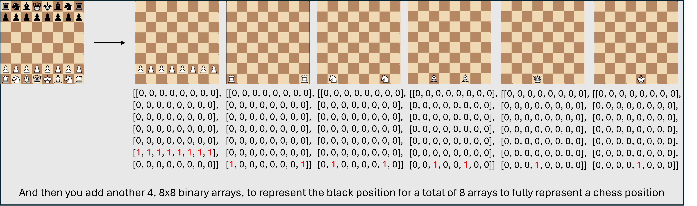

# AfterMarketFish
The worse chess AI 

As a baseline plan, I'm trying to code a purely ML approach to chess. The best chess computers such as stockfish for example use an algorithm to assign a float to a position between 1 and -1, where the closer it is to one, the more it favors white and the closer it is to -1, the more it favors black. It will then systematically walk through every possible position and depending on the depth it is set to, all the possible positions after that to determine which move will lead to the highest average advantage to the side it is playing as.

This is an interesting approach and highlights the analytical nature of creating chess bots. Which is why I think it would be interesting to approach this with an ML model. How does machine learning compare to a more algorithmic approach. 

I will be the first to admit if it were better, then everybody would be doing it. Stockfish is the best for a reason and perhaps it is pure folly to believe that an Ai can come anywhere close to it, but I think that since I am going to training it to learn from human behavior and real moves perhaps in the end I will get a model that while being worse than stockfish will play more like a human.

A great critique of stockfish is that it often makes nonsensical moves that make little to no sense to a human and that leads to worse chess. The beauty of chess is analyzing the moves made and the tactics being used by both players but playing against a computer that throws away classical chess techniques leads to its opponent not really being able to predict its moves or understand theory.

While impressive it doesn’t really serve as a helpful learning tool, more of a monument to how "perfect" chess is played, which while impressive, I don't think is that interesting.

The goal of this project is to instead train an ML model, on raw move data made by real players to emulate how a human would play and respond to moves. To ensure we don't fall into the pitfalls of LLM chess I will also incorporate a probability max over only legal moves to ensure we keep hallucinations to a minimum. As far the move data goes, I think that encoding it traditionally as an alpha numeric code would be detrimental as the Model would likely factor the raw 'value' of the move into account which would be counter intuitive. So I think using a bit mask of all the pieces on the board would make more sense where we have separate layers for each piece. 

The ML model I'm going to use is a Feed forward Neural Network. 

The only models I’m familiar with are those taught in my Intro to ML class. While it may not be the most advanced, it’s the best option I can think of for this use case. An RNN is really intended for sequence tasks like language modeling, a decision tree would be insanely complicated with hundreds of binary features, and logistic regression or SVMs aren’t designed to capture the complex, nonlinear patterns in chess positions—they’re better suited to simpler classification problems.

'''text
AfterMarketFish/
├── README.md
├── LICENSE
├── requirements.txt            # Library requirements
│
├── data/
|   └──default
│       ├── raw/                # Raw PGNs
│       └── processed/          # Processed model
│
├── src/
│   ├── data/
│   │   └── loadData.py         # PGN → bitboard tensor pipeline
│   │   └── dataset.py          # PyTorch Dataset/DataLoader
│   │
│   ├── models/
│   │   └── ffnn.py             # FFNN architecture
│   │
│   ├── training/
│   │   └── train.py            # training loop
│   │
│   ├── predict/
│   │   └── predict.py          # load a model + board state → move
│
├── scripts/
│   ├── run_train.sh            # bash wrapper for train.py
│   └── run_predict.sh          # bash wrapper for predict.py
│
└── tests/
    ├── test_loader.py
    ├── test_model.py
    └── test_training.py
'''